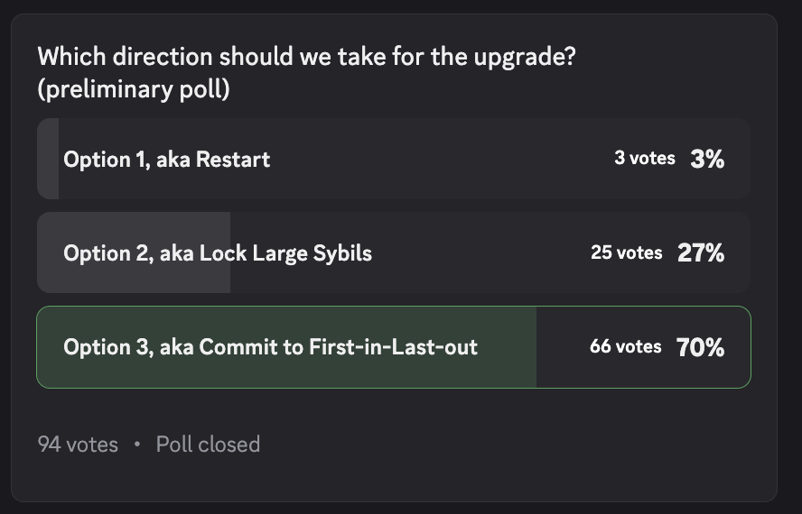

<!-- truncate -->

## Summary of Current Events

Since our inception in 2019 this community has been building a decentralized network grounded in unique tokenomics and thoughtful mechanism design. In 2024, a series of deceitful actions strained our community and threatened our ability to thrive. Yet our collective commitment never wavered and our consensus mechanisms worked to allow the community to respond quickly. Together, we doubled down on integrity and held to account those individuals who sought to reap unearned rewards at the expense of the whole.

Since then, the community has been exploring additional enhancements to further secure the future’s project and recently proposed 3 go forward options:

**Option 1 - Restart:** Launch a new chain, more like a typical commercial blockchain. Everything is on the table, perhaps a pre-mine, investors, or an ICO.

**Option 2 - Lock Large Sybils:** Selectively re-lock large accounts, including probable sybil miners, validators, sprayed accounts. Keeps all balances and unlocks the same for small accounts.

**Option 3 - Commit to First-in-Last-out:**

- Maintain all balances, but convert every account into a slow wallet with zero unlocked coins.
- Unlocks remain at 35,000 coins per epoch.
- Introduce sybil resistance mechanism through vouching for end-user accounts.
- Allow community wallets limited liquidity for administrative use.

In a recent sentiment poll (see below screenshot): **70% of active participants, 66 out of 94 votes, chose Option 3, a return to our foundational First-in-Last-out (FILO) principle.** This isn’t just a preference, it’s a mandate. This proposal is our answer and a bold step towards realigning with the values that define us.  We refer to each giant step forward in our collective progress as a “Level”.  This document will refer to prior Levels 6 & 7 and describe our future in Level 8.

## Summary of Level 7 Issues
Level 7 exposed some opportunities for improvement.
It began with manipulations in Level 6, where bad actors abused community wallets, our decentralized endowments, for personal gain. 
These bad actors, cloaked as analysts, siphoned tokens and created sham markets to dump them, profiting while the network bled. 
The result? [A hard fork in Level 7](https://docs.openlibra.io/blog/proposals/scorpions-claw-proposal) to exclude the worst offenders, but the damage lingered. 
Markets flooded with tokens, Open Libra’s value crashed, and early believers were left stranded – a textbook First-in-First-out (FIFO) betrayal, the antithesis of FILO. 
The community fought back, proving its resilience, but the chaos revealed a truth: without stronger safeguards, trust and motivation erode.
This proposal exists to fix that. You can read the [Open Libra Level 7 Post-mortem here](https://www.google.com/url?q=https://docs.google.com/document/d/e/2PACX-1vQKWRMSIzc1yLn32TYqKMA_Ukkt8bkIjqU9F55gGpcBR1mEqU5FmNEIJ4DZ1o3caQHFutjifDgsXa5_/pub&sa=D&source=editors&ust=1747153318585623&usg=AOvVaw2fZPZvNUMX6R95AEwyaFVz).

## The Recommendation
Here’s the plan to restore FILO and secure our future:

- **Founder Accounts:** All pre-Level 8 accounts become Founder Accounts.
- **Slow Wallets Expansion:** Proven mechanisms from Validator accounts, Slow Wallets and Vouching, will be extended to all Founder Accounts. Coins start fully locked, unlocking 35K daily at each epoch.
- **Vouching Requirement:** Founder Accounts need vouches from peers to unlock, a community-driven filter against sybils and bad actors.
- **Community Wallets Overhaul:** These wallets face the same sybil resistance. Donors must reauthorize them via vote, ensuring accountability. Up to 1% of locked funds can unlock for action, repayable within a year, or the wallet deactivates.

This isn’t a reinvention, it’s a return to what works, scaled to protect everyone committed to Open Libra’s long-term mission. This isn’t damage control; it’s a leap forward.

By reducing entropy and increasing coordination, the network becomes leaner and stronger. One that is poised to grow, not just survive.

Recommitting to FILO, we prevent exit-driven panics like Level 7’s “run on the bank,” It protects those who’ve been building all along with us. Reactivating dormant accounts with Slow Wallets and administrative budgets to reinvigorate the community. Reauthorizing Community Wallets ensures they serve their donors, not exploiters, fostering transparency and purpose.

## Values, the Guardrails for the Recommendation
- **Reward Commitment, Not Exit Speed:** choices rest on unshakable principles; FILO uplifts the builders, not the opportunists.
- **Plans Measured in Centuries:** We’re crafting a legacy, not chasing trends.
- **No Favorites, No Shortcuts:** Equal rules, no exceptions, That’s how trust stays intact.
- **Act in the Light, or Lose the Right:** Transparency is our shield against deceit.
- **Strength in Restraint:** We refine what works, avoiding reckless overhauls.
- **Do No Harm, Protect the Honest:** Honest contributors flourish; leeches falter.
- **Collective Vigilance:** Every member guards our ethos, closing gaps for abuse.

These aren’t slogans, they embody the moral compass steering us back to stability.

## Summary of Evaluated Solutions
We explored every angle before landing here:

1. **Maintain Status Quo:** Ignoring the problem risked collapse — unacceptable.
2. **Chain Reset:** A hard fork to adopt crypto industry practices (inventors, foundation, pre-mint) was simple but erased years of effort.
3. **Selective Migration:** Hard forking bad actors is reserved for the most dramatic cases, in this case we're not interested in punishment or survival, but in long term viability. .
4. **Whale Locking:** Locking big accounts with vesting tempted us, but it was too clumsy, error prone, and had a number of subjective parameters.

Expanding existing policies won out because it is proven, aligns with our core values, and practical.

### Expected Objections and Rebuttals
Critics will emerge. We’re ready:

“This punishes long-term holders!” No, it shields them, ensuring only the committed unlock funds.

“It’s too complicated!” We’ve streamlined it to address only the essentials while addressing the core issues. We expand existing policies.

“Bad actors will still slip through!” It’s true perfection is a myth, but vouching for sybil resistance greatly curtails their room to maneuver.

“Exchanges like Comswap suffer!” We expect all users from pre-market venues to be on equal footing with the native coin holders. All third party venues were notified or invited to participate months in advance.

## A Vision for Level 8
Open Libra doesn’t want to be just another crypto footnote; our community wants to pioneer the next level of the game. If Level 8 is successful it will launch the decentralized endowment model. At this stage Community Wallets find their purpose, funding century-spanning projects. Open Libra becomes patient capital, a tool for building, not speculating. Dormant wallets awake, accountable and active. The network grows more resilient, more transparent, community powered, and able to recruit the wise minds and capable hands needed to scale.

## FAQ
Q: Will my coin balance change?\
A: No, your total stays the same.

Q: What happens to regular holders?\
A: All wallets convert to Slow Wallets, needing Web-of-Trust (WoT) Vouching to unlock.

Q: What’s a Slow Wallet?\
A: A slow account, releasing 35K unlocked coins per epoch, once vouched.

Q: How do I get vouched?\
A: Get vouches from other founders, then it’s automatic.

Q: What’s Web-of-Trust (WoT) Vouching?\
A: Peer system where founders verify each other, blocking bad actors and re-engaging the community.

Q: What about Community Wallets?\
A: They need donor votes to stay active and can unlock 1% for operations, repayable yearly.
